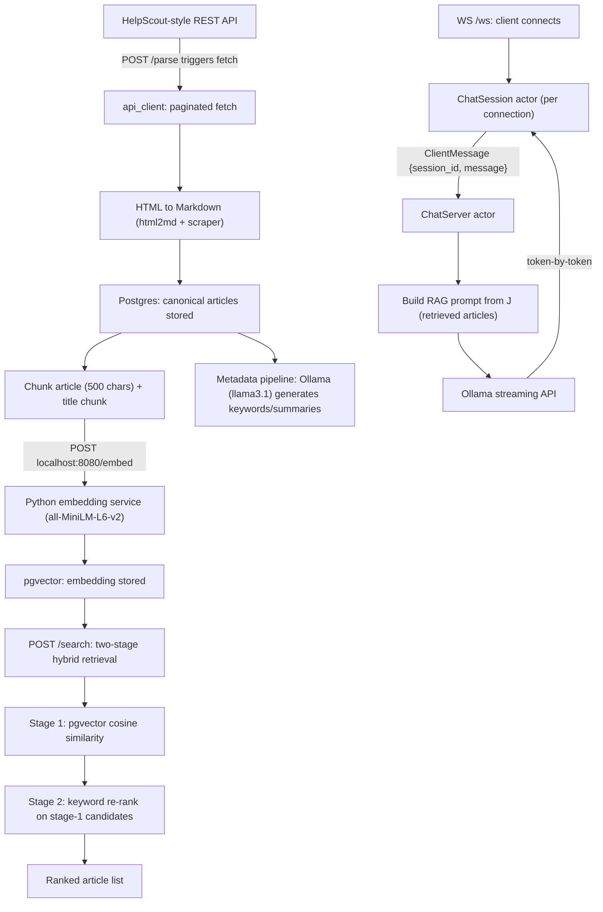

# Rag Engine RS

> Part of the **Bastion** ecosystem — see the [bastion-os](https://github.com/bredmond1019/bastion-os) front door for the full architecture.

An AI-powered help-documentation backend written in Rust. It ingests articles from a
HelpScout-style API, converts them to Markdown, chunks and embeds them into PostgreSQL (via
[`pgvector`](https://github.com/pgvector/pgvector), an extension that lets Postgres store and
search vector embeddings directly), and serves **hybrid semantic + keyword retrieval** alongside
a **streaming LLM chat** interface over WebSockets — with all inference running locally through
[Ollama](https://ollama.com).

**Backend only.** No UI is included; this is an AI infrastructure service, not a full-stack app.

---

## What this is for

- A worked example of **retrieval-augmented generation (RAG)** — grounding an LLM's answers in a
  private document set instead of its training data alone — built as a real Rust service rather
  than a notebook.
- Demonstrates a **hybrid retrieval** strategy (vector search narrowed, then keyword re-ranked)
  and **actor-based WebSocket streaming** (Actix actors), two patterns that show up repeatedly in
  production chat/search systems.
- Everything — Postgres, the embedding model, the chat model — runs **locally**. No API keys to a
  hosted LLM provider are required to run it end to end.

---

## Quickstart

Run every command below from a terminal, in this repo's root, in order.

```bash
# 1. Clone and configure
git clone https://github.com/bredmond1019/rag-engine-rs
cd rag-engine-rs
cp .env.example .env
# Edit .env — at minimum set DATABASE_URL, API_KEY, API_BASE_URL

# 2. Run database migrations (creates all tables; safe on a fresh DB)
diesel migration run

# 3. Start the Python embedding service (separate terminal, stays running)
cd python_services
pip install -r requirements.txt
python embedding_service.py   # listens on localhost:8080

# 4. Run the Rust backend (a third terminal, from the repo root, stays running)
cargo run
# Server listens on http://127.0.0.1:3000

# 5. Hit an endpoint
curl http://127.0.0.1:3000/
# → "Welcome to the backend API. It's working!"
```

There is no `docker-compose.yml` or `Makefile` in this repo — the three processes above (Postgres,
the Python embedding service, the Rust binary) are started directly.

### Prerequisites

| Needed | Check | If missing |
|---|---|---|
| Rust (2021 edition toolchain) | `cargo --version` | [rustup.rs](https://rustup.rs) |
| PostgreSQL with `pgvector` | `psql --version`; extension must be installed | Install Postgres, then the [`pgvector`](https://github.com/pgvector/pgvector) extension |
| Diesel CLI | `diesel --version` | `cargo install diesel_cli --no-default-features --features postgres` |
| Ollama, with a chat model pulled | `ollama list` | Install [Ollama](https://ollama.com), then `ollama pull llama3.1` |
| Python 3.9+ | `python3 --version` | Install via your OS package manager |

> **macOS / Homebrew:** if Postgres/`libpq` was installed via Homebrew, exporting the library path
> is required at build time, or `cargo build`/`cargo run` will fail to link:
> ```bash
> export LIBRARY_PATH="/opt/homebrew/opt/libpq/lib:$LIBRARY_PATH"
> ```

---

## Pipeline overview



1. **Ingest** — `POST /parse` fetches paginated articles from the configured HelpScout-style source
   API and hands each collection to the sync pipeline.
2. **Convert** — each article's HTML is converted to Markdown before storage.
3. **Store** — canonical articles land in Postgres via [Diesel](https://diesel.rs).
4. **Chunk + embed** — each article is split into ~500-character chunks (plus one title chunk),
   sent to the Python embedding microservice, and the resulting vectors are stored in `pgvector`.
5. **Metadata (parallel, optional)** — a separate bounded-concurrency pipeline asks Ollama to
   generate keywords/summaries per article.
6. **Retrieve** — `POST /search` runs semantic vector search first, then re-ranks by keyword match
   within that candidate set, and fuses the two scores.
7. **Chat** — a client opens `GET /ws`, gets a `session_id`, sends `{session_id, message}`; the
   server retrieves relevant articles, builds a grounded prompt, and streams the Ollama response
   back token-by-token.

You, as the operator, personally do steps 1 (trigger ingestion), 4/5 (trigger embedding/metadata
generation) and 7 (send chat messages) — steps 2, 3, and the two retrieval stages run automatically
inside the request/response cycle.

---

## Endpoint reference

All routes are registered in [`src/routes/mod.rs`](src/routes/mod.rs).

| Method | Path | What it does |
|---|---|---|
| GET | `/` | Health check — returns a static welcome string |
| POST | `/health` | Probes the Python embedding service's own `/health` |
| GET | `/test-embed` | Round-trips a fixed test string through the embedding service |
| POST | `/parse` | Kicks off article sync from the source API (async; returns `202 Accepted` immediately) |
| GET | `/job/{job_id}/status` | Status of a background job by UUID |
| POST | `/generate-embeddings` | Generates and stores embeddings for all articles missing one (async) |
| GET | `/get-failed-embeddings` | Lists articles whose embedding generation failed |
| POST | `/reembed-all` | **Destructive-adjacent**: re-embeds every article from scratch (async) |
| POST | `/search` | Hybrid two-stage retrieval; body `{"query": "..."}` |
| GET | `/metadata-generation` | Runs the Ollama metadata pipeline over a batch of articles (async) |
| GET | `/failed-articles-metadata-generation` | Retries metadata generation for articles that previously failed |
| GET | `/ws` | WebSocket upgrade — chat |

### WebSocket chat

```bash
# Any WS client, e.g. websocat:
websocat ws://127.0.0.1:3000/ws
```

On connect, the server immediately sends:

```json
{ "type": "chat_session_started", "session_id": "<uuid>" }
```

Send messages back using that `session_id`:

```json
{ "session_id": "<uuid-from-above>", "message": "How do I reset my password?" }
```

The server streams back `{"type": "ai_message", "message": {...}}` frames as Ollama generates
tokens, grounded in articles retrieved by the hybrid search pipeline.

---

## Engineering highlights

**Hybrid two-stage retrieval** ([`src/services/search/two_stage_retrieval.rs`](src/services/search/two_stage_retrieval.rs))
Semantic vector search narrows the candidate set; keyword re-rank then scores within that set and
fuses the two signals. This beats pure vector search on exact-term queries without sacrificing
recall on paraphrased ones. Sorting uses `f64::total_cmp` (NaN-safe) rather than
`partial_cmp().unwrap()`, which would panic on a NaN score.

**Actix actor model for streaming chat** ([`src/services/chat/`](src/services/chat/))
Each WebSocket connection becomes a `ChatSession` actor; a central `ChatServer` actor routes
messages and manages session state. [Actix](https://actix.rs) actors are Rust's message-passing
concurrency primitive — each actor owns its state and only mutates it in response to a received
message, so there's no shared-mutex chat state to get wrong. Ollama's streaming API is consumed
token-by-token and forwarded over the WS connection in real time.

**Custom round-robin Ollama load balancer** ([`src/utils/ollama_load_balancer.rs`](src/utils/ollama_load_balancer.rs))
A round-robin balancer backed by a Rayon thread pool distributes inference requests across
multiple local Ollama instances. Included but currently shelved pending multi-GPU hardware; not
wired into `main.rs` — the interface is stable and ready to re-wire.

**Bounded-concurrency metadata pipeline** ([`src/services/metadata_generator/`](src/services/metadata_generator/))
A concurrency limit (`MetadataGenerator::new(limit)`) caps in-flight Ollama calls during bulk
metadata generation, with structured success/partial/failure accounting and failed-ID persistence
for retry via `/failed-articles-metadata-generation`.

---

## Tech stack

| Layer | Technology |
|---|---|
| Language | Rust (2021 edition) |
| HTTP / WebSocket | Actix-web 4, Actix actors |
| Database | PostgreSQL + `pgvector` extension |
| ORM / migrations | [Diesel](https://diesel.rs) 2 |
| LLM inference | Ollama (local) via vendored `ollama-rs` fork |
| Embeddings | Python microservice (`python_services/`), `sentence-transformers` `all-MiniLM-L6-v2` |
| Async runtime | Tokio |
| HTML → Markdown | html2md + scraper |

---

## Vendored `ollama-rs` fork

This project uses a fork of [`ollama-rs`](https://github.com/pepperoni21/ollama-rs) vendored at
`vendor/ollama-rs`. The upstream crate is at 0.3.5; this fork stays on 0.2.0 because the
chat-history API changed upstream in a way that is incompatible with the per-session Actix actor
model — upstream now requires an externally managed `Arc<Mutex<MessagesHistory>>`, but the actor
model owns history per-session internally via `new_default_with_history`. One borrow-checker fix
was applied on top of the upstream 0.2.0 tag. See
[`vendor/ollama-rs/VENDORED.md`](vendor/ollama-rs/VENDORED.md) for the full diff description.

---

## Testing

```bash
cargo test
```

- `convert_html_tests` (14 tests) — fully self-contained, always runnable.
- `api_client_tests` and `article_tests` — require a running Postgres reachable via `DATABASE_URL`
  (and, for the article tests, an existing schema); they skip gracefully rather than fail if that
  connection isn't available.

---

## Troubleshooting

| Symptom | Likely cause | What to check |
|---|---|---|
| `cargo build`/`cargo run` fails to link against `libpq` | Homebrew Postgres puts `libpq` in a non-default path | Export `LIBRARY_PATH` as shown in Prerequisites |
| `/search` or chat returns an error mentioning the embedding service | Python embedding service isn't running | Confirm `python embedding_service.py` is up on `localhost:8080`; hit `POST /health` |
| `/parse` returns `202` but nothing happens | Source API credentials wrong, or job runs async and fails silently | Check server logs (`log/application.log`, per [`log4rs.yaml`](log4rs.yaml)); verify `API_KEY`/`API_BASE_URL` in `.env` |
| Chat never streams a response | Ollama not running, or model not pulled | `ollama list`; `ollama pull llama3.1` |
| `diesel migration run` fails | `pgvector` extension not installed, or `DATABASE_URL` wrong | Confirm the extension is installed in the target database |

---

## Roadmap / Known limitations

- **Failure handling:** the metadata failure fallback currently writes a local file
  (`failed_metadata_updates_{id}.txt`). Swapping it for a distributed-safe dead-letter queue
  (Redis/Postgres) is planned for cloud-native readiness.
- **Ollama load balancer** is implemented but not wired into `main.rs` — see Engineering highlights
  above.

---

## See also

- [`vendor/ollama-rs/VENDORED.md`](vendor/ollama-rs/VENDORED.md) — full detail on the vendored fork
- [`.env.example`](.env.example) — every configuration variable, with defaults and notes
- [`LICENSE`](LICENSE) — MIT

## License

MIT — see [LICENSE](LICENSE).
